  <a href="https://github.com/tuanha1508">
    <picture>
      <source media="(prefers-color-scheme: dark)" srcset="./dark_mode.svg" />
      <source media="(prefers-color-scheme: light)" srcset="./light_mode.svg" />
      
    </picture>
  </a>

